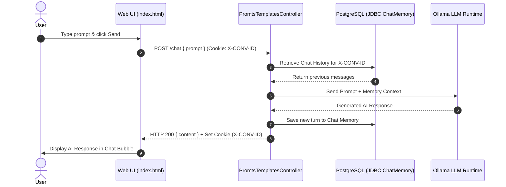

# 🤖 Spring AI Chatbot Application

A modern, full-stack AI Chatbot application built using **Spring Boot**, **Spring AI**, **Ollama**, and **PostgreSQL**. The application leverages local Large Language Models (LLMs) and provides persistent conversation memory stored in a PostgreSQL database via Spring AI JDBC Chat Memory.

---

## 🚀 Features

- **Local LLM Integration**: Powered by Spring AI and Ollama running models like `qwen2.5`.
- **Persistent Chat Memory**: Uses Spring AI's `ChatMemory` with PostgreSQL JDBC storage to retain context across sessions.
- **Session Tracking**: Automatic conversation session tracking using an `X-CONV-ID` HTTP Cookie.
- **Interactive UI**: Web interface built with Spring Boot Thymeleaf, Bootstrap 5, and jQuery featuring animated auto-resizing input and chat bubbles.
- **Prompt Templating**: Externalized prompt templates (`.st` files) for flexible system and user prompt management.
- **Containerized Infrastructure**: Quick database setup via Docker Compose.

---

## 🛠️ Tech Stack

- **Java**: 25
- **Spring Boot**: 4.1.1
- **Spring AI**: 2.0.1 (Ollama Starter & JDBC Chat Memory Starter)
- **Database**: PostgreSQL 17 (Dockerized)
- **AI Model Runtime**: [Ollama](https://ollama.com/) (`qwen2.5:0.5B-F16` or custom)
- **Frontend**: Thymeleaf, Bootstrap 5.3.8, jQuery
- **Build Tool**: Maven

---

## 📁 Project Structure

```text
rajesh-spring-ai-course/
├── compose.yml                             # Docker Compose file for PostgreSQL container
├── pom.xml                                 # Maven dependencies & build configuration
└── src/
    └── main/
        ├── java/
        │   └── org/example/
        │       ├── Main.java               # Spring Boot Application entry point
        │       └── PromtsTemplatesController.java # REST Controller handling /chat endpoint
        └── resources/
            ├── application.properties      # Spring Boot & Spring AI configurations
            ├── prompts/
            │   ├── system-message.st       # System prompt template
            │   └── user-message-1.st       # User prompt template
            ├── static/
            │   ├── robot.svg               # Chatbot avatar asset
            │   └── styles.css              # Custom UI styling
            └── templates/
                └── index.html              # Main chat interface template
```

---

## ⚙️ Configuration

Key settings can be modified in [`application.properties`](file:///Users/rajesh/Desktop/Java/rajesh-spring-ai-course/src/main/resources/application.properties):

```properties
spring.application.name=ai-course

# Ollama Server Configuration
spring.ai.ollama.base-url=http://localhost:12434
spring.ai.ollama.chat.options.model=qwen2.5:0.5B-F16
spring.ai.ollama.chat.options.temperature=1

# Spring AI JDBC Chat Memory
spring.ai.chat.memory.repository.jdbc.initialize-schema=always
```

---

## 📋 Prerequisites

Before running the application, make sure you have the following installed and running:

1. **Java 25 JDK**
2. **Maven 3.8+**
3. **Docker & Docker Desktop / Docker Engine**
4. **Ollama**: Installed and running locally.

---

## 🚦 Getting Started

### 1. Start the PostgreSQL Database

Run Docker Compose to start the PostgreSQL database container (mapped to host port `15432`):

```bash
docker compose up -d
```

### 2. Start Ollama and Pull the Model

Ensure Ollama is running and download the target model:

```bash
ollama serve
# In a separate terminal tab:
ollama pull qwen2.5:0.5B-F16
```

*(Note: If running Ollama on a custom port or host, update `spring.ai.ollama.base-url` in `application.properties` accordingly).*

### 3. Build and Run the Application

Execute the following command in the project root directory:

```bash
mvn spring-boot:run
```

### 4. Access the Web Interface

Open your browser and navigate to:

👉 **[http://localhost:8080](http://localhost:8080)**

---

## 🔌 API Reference

### Send Chat Message

- **Endpoint**: `POST /chat`
- **Headers**: `Content-Type: application/json`
- **Cookies**: `X-CONV-ID` *(optional; automatically set by the server on initial request for session memory)*

#### Request Body:
```json
{
  "prompt": "Hello! What can you help me with?"
}
```

#### Response:
```json
{
  "content": "I am a general purpose and technical assistant chatbot..."
}
```

---

## 🧪 Architecture & Component Flow



---

## 📄 License

This project is open-source and available for educational and development purposes.
